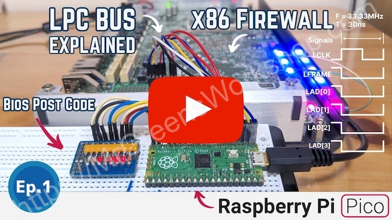

## BIOS POST Code Reader with the Raspberry Pi Pico

[](https://github.com/MrGreensWorkshop/RasPiPicoSDK-PicoBiosPostCodeReader/issues)
[](https://github.com/MrGreensWorkshop/RasPiPicoSDK-PicoBiosPostCodeReader/blob/main/README.md#readme)
[](https://github.com/MrGreensWorkshop/RasPiPicoSDK-PicoBiosPostCodeReader/blob/main/README.md#readme)
[](https://github.com/MrGreensWorkshop/RasPiPicoSDK-PicoBiosPostCodeReader/blob/main/LICENSE.txt)
[](https://github.com/sponsors/MrGreensWorkshop "Support me on GitHub Sponsors")
[](https://patreon.com/MrGreensWorkshop "Support me on Patreon")
[](https://ko-fi.com/MrGreensWorkshop "Tip me via Ko-fi")

---

<div align="center">
  <a href="https://youtu.be/C4Kq1r9A0k0"></a>
</div>

Everything is covered in [the video above](https://youtu.be/C4Kq1r9A0k0).

### Introduction

You can make your own POST card (BIOS POST code reader) using the Raspberry Pi Pico. It can also be used as an LPC bus sniffer. I covered everything about the LPC bus for reading POST codes in the video above.

Thank you for considering [supporting my work!](#you-can-support-my-work)

#### Background

I usually use old or junk parts on my projects to reduce electronic waste and support the SDGs. I was working on a project to reuse an x86-based firewall that I came across in an online auction. And I found myself reading BIOS post-codes. I thought it would be a good opportunity to talk about how the LPC bus and I/O cycles work by making a BIOS POST code reader project. So, here we are.

### Features / Fixes

- LPC bus sniffer
- POST code output to USB CDC

### Compilation

1. Clone the repo as shown below, or [download latest release](https://github.com/MrGreensWorkshop/RasPiPicoSDK-PicoBiosPostCodeReader/releases/latest).

    ```shell
    git clone https://github.com/MrGreensWorkshop/RasPiPicoSDK-PicoBiosPostCodeReader.git
    ```
1. Please make sure you are using the [Pico SDK v1.5.0](https://github.com/raspberrypi/pico-sdk/releases/tag/1.5.0) or later because some of the implementations are necessary.
1. Open the project in VS Code because it adds SDK to the environment string. (Check the [.vscode/settings.json](https://github.com/MrGreensWorkshop/RasPiPicoSDK-PicoBiosPostCodeReader/blob/main/.vscode/settings.json) file for details.)
    - Or add PICO_SDK_PATH to your environment string. 
1. Compile using build.sh 
    ```shell
    chmod +x build.sh
    ./build.sh
    ```
    - Or run
    ```shell
    cmake -B build -S . && make -j4 -C build
    ```
    
### Running

1. Make sure you watch the video at the top of the page.
2. Build the circuit below and connect it to the LPC bus on the target PC.

    :rotating_light: Caution: If you short circuit or damage the LPC bus, you may end up with a non-bootable PC. Because earlier PC BIOS were connected to the LPC bus. TPM and Super I/O devices (keyboard, mouse, serial or parallel port, floppy, fans, LEDs, and other devices) connected to the LPC bus will also fail.
"Do it at your own risk."


3. Get the binary
    - You can compile the project and get the binary as explained above.
    - Or you can use precompiled binary files from the [latest release](https://github.com/MrGreensWorkshop/RasPiPicoSDK-PicoBiosPostCodeReader/releases/latest), download the "binary_{tag}.zip" and unzip.
1. Put the Raspberry Pi Pico into bootloader mode by pushing the bootsel button while plugging it into your computer.
1. Copy the `build/PicoBiosPostCodeReader.uf2` file to the Raspberry Pi Pico either by dragging and dropping or using the `cp` command as shown below.

    | Linux | macOS |
    | :---- | ----- |
    | `cp build/PicoBiosPostCodeReader.uf2 /media/<user>/RPI-RP2` | `cp build/PicoBiosPostCodeReader.uf2 /Volumes/RPI-RP2` |

1. Open your favorite serial terminal app, then open the corresponding serial port.

### You Can Support My Work

Creating projects like this takes a great amount of time. Much appreciated if you consider supporting me so that I can continue projects like this and creating new contents for everyone.

- You can support me on [GitHub Sponsors](https://github.com/sponsors/MrGreensWorkshop "Support me on GitHub Sponsors") (monthly or one time)
- You can be one of my patrons on [Patreon](https://patreon.com/MrGreensWorkshop "Be my Patron") (monthly)
- You can tip me via [Ko-fi](https://ko-fi.com/MrGreensWorkshop "Tip Me via Ko-fi") (one time)

### Contribute

Pull Requests are welcome. Please check the instructions in the Issues and Pull Request templates.

### License

As it says in the [Apache License 2.0](https://github.com/MrGreensWorkshop/RasPiPicoSDK-PicoBiosPostCodeReader/blob/main/LICENSE.txt), you can use my code anywhere as long as you include the license file and copyright notice. Also, state if you make any changes.

`Copyright (c) 2022 Mr. Green's Workshop https://www.MrGreensWorkshop.com`

Thank you!
